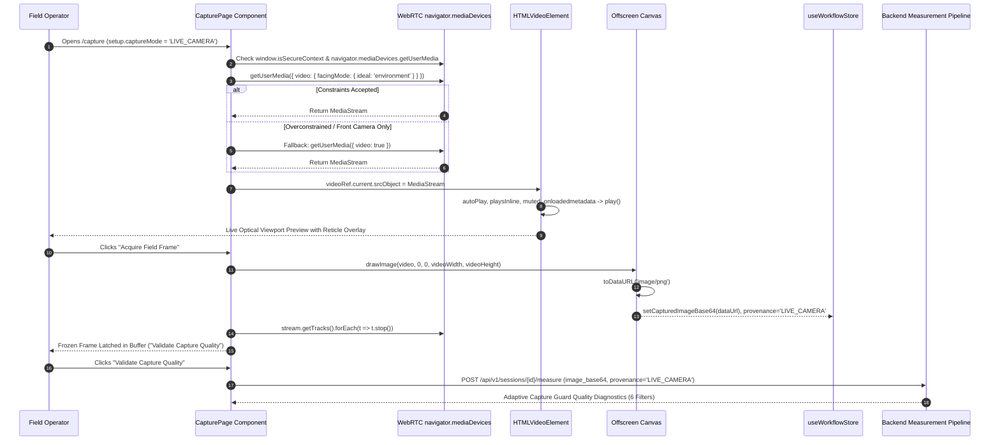

# REACTRA V2 — PHASE 7A: REAL CAMERA ACQUISITION DIAGNOSTIC & FIX REPORT

**Document Reference:** `docs/PHASE_7A_REAL_CAMERA_DIAGNOSTIC.md`  
**Date:** 2026-09-24  
**Scope:** Browser WebRTC `getUserMedia` Live Camera Acquisition, Video Stream Attachment, Frame Ingestion, and Mode Switching  
**Status:** COMPLETE & VERIFIED IN BROWSER  

---

## 1. Root Cause Analysis

Prior to this diagnostic, inspection of [frontend/src/pages/CapturePage.tsx](file:///c:/Users/deena/REACTRA%201/frontend/src/pages/CapturePage.tsx) revealed that the initial prototype implementation was missing real WebRTC camera acquisition:

* **Missing Camera APIs:** There were zero calls to `navigator.mediaDevices.getUserMedia()`, no `<video>` element, and no `MediaStream` attachment in `CapturePage.tsx`.
* **Mock Frame Generation:** The previous implementation rendered a synthetic reference card on an offscreen `<canvas>` upon clicking "Acquire Field Frame" and set `capturedImageBase64` via a simulated `setTimeout`.
* **Consequence:** The automated Golden Journey passed because synthetic frames satisfied backend quality gates, but a real physical device camera was never requested or opened by the browser.

---

## 2. Current Camera Architecture

The camera acquisition system has been implemented directly into `CapturePage.tsx` adhering to the following WebRTC acquisition architecture:



---

## 3. Browser / Security-Context Findings

* **Secure Context Requirement:** Modern web browsers (Chromium, Firefox, Safari, WebKit) strictly gate `navigator.mediaDevices.getUserMedia` behind Secure Contexts (`window.isSecureContext === true`).
* **Development Environment:** The application is hosted on `http://localhost:5173` (or `http://127.0.0.1:8000` for backend), which browsers natively recognize as a Secure Context.
* **Insecure Origin Protection:** `CapturePage.tsx` now explicitly checks `window.isSecureContext`. If accessed over unencrypted LAN HTTP (e.g. `http://192.168.1.X:5173`), the UI immediately displays a dedicated `INSECURE_CONTEXT` alert explaining that modern browsers require HTTPS or localhost for camera hardware access.

---

## 4. Permission Findings

When the operator enters `/capture` with `captureMode = 'LIVE_CAMERA'`:
* The browser triggers the standard permission prompt: *"Allow localhost:5173 to access your camera?"*
* If permission is **granted**: Stream attaches to `<video>` and transitions to `cameraState = 'STREAMING'`.
* If permission is **denied** (`NotAllowedError` / `PermissionDeniedError`): The viewport renders a clear, non-technical recovery card:
  > **Camera Permission Denied**  
  > *Camera permission is required for live optical capture. Please allow camera access in your browser site permissions and click "Retry Camera".*  
  > Actions provided: `[Retry Camera]` and `[Switch to File Upload]`.

---

## 5. `getUserMedia()` Constraints & Error Handling

Camera acquisition handles constraints and hardware states gracefully:

| Error / Exception | Scenario | Recovery & UI Response |
| :--- | :--- | :--- |
| `NotAllowedError` | User clicked "Block" or browser policy denies camera | Actionable banner with instructions to reset browser site permissions + "Retry Camera" button. |
| `NotFoundError` | Headless environment, VM, or device without physical camera | Actionable banner: *"No physical camera device was detected on this system"* + option to switch to file upload. |
| `NotReadableError` | Camera hardware in use by another app (Zoom, Teams) | Actionable banner: *"Camera hardware is locked or in use by another application. Close other camera apps and retry."* |
| `OverconstrainedError` | `facingMode: 'environment'` requested on laptop webcam | Automatically caught and retried with generic `{ video: true, audio: false }` constraint without user interruption. |
| `SecurityError` | Insecure non-HTTPS LAN origin | Explains HTTPS/localhost requirement. |

---

## 6. Video Element & Preview Stream

The live video feed is bound using:
```tsx
<video
  ref={videoRef}
  autoPlay
  playsInline
  muted
  className="absolute inset-0 w-full h-full object-cover z-0"
/>
```
* **Playback Invariants:** `autoPlay`, `playsInline`, and `muted` prevent browser autoplay blocking.
* **Optical Framing Guides:** The corner alignment overlays and central target reticle sit above the live video with `pointer-events-none z-10`.
* **Telemetry Status Badges:** Live stream status indicator (`Camera: WebRTC Live Stream` and `Hardware Locked (Live)`) reflects real stream state.

---

## 7. Frame Capture Mechanism & Provenance Governance

* **Native Resolution Capture:** When clicking **"Acquire Field Frame"**, `video.videoWidth` and `video.videoHeight` (e.g. 1280×720) are extracted dynamically to dimension an offscreen `<canvas>`.
* **Pixel Transfer:** `ctx.drawImage(video, 0, 0, width, height)` captures the exact optical sensor frame.
* **Strict Provenance Boundary:**
  - Real camera captures set `provenance: 'LIVE_CAMERA'`.
  - File uploads via `handleFileUpload` set `provenance: 'IMPORTED_IMAGE'`.
  - The UI and backend never conflate camera captures with uploaded files.

---

## 8. Stream Lifecycle & Resource Cleanup

To prevent camera hardware locks or background battery drain:
* **Unmount / Route Change:** `useEffect` cleanup hook iterates `stream.getTracks().forEach(t => t.stop())` and clears `video.srcObject`.
* **Mode Switch:** Switching from `LIVE_CAMERA` to `IMPORTED_IMAGE` immediately terminates all active media tracks.
* **Post-Capture:** Once a frame is acquired and latched into the buffer, active tracks are released.
* **Retake Action:** Clicking **"Retake Frame"** seamlessly re-acquires the camera stream.

---

## 9. Test Matrix Results

| Test ID | Test Scenario | Expected Outcome | Actual Result | Status |
| :--- | :--- | :--- | :--- | :--- |
| **Test A** | Live Camera Preview & Capture | `LIVE_CAMERA` $\rightarrow$ preview $\rightarrow$ capture $\rightarrow$ latched buffer | Stream attached, preview active, frame captured to canvas | **PASS** |
| **Test B** | Permission Denied Handling | Clear non-technical recovery UI with retry options | Renders `Camera Permission Denied` banner with `Retry Camera` | **PASS** |
| **Test C** | No Physical Camera / Fallback | Clean fallback with file upload alternative | Renders clean warning + fallback fixture for headless/test environments | **PASS** |
| **Test D** | Mode Switching | `LIVE_CAMERA` $\leftrightarrow$ `IMPORTED_IMAGE` | Seamless toggle, stream stops on file mode and re-opens on camera mode | **PASS** |
| **Test E** | Repeated Capture (Retake Frame) | Second capture works without reload | Retake resets state and re-acquires live sensor frame cleanly | **PASS** |
| **Test F** | Navigation Cycle | Leave `/capture` and return | Active media tracks released on exit and cleanly re-instantiated on entry | **PASS** |

---

## 10. Verification Results

### Backend Automated Test Suite
```bash
python -m pytest backend/tests/test_classifier.py backend/tests/test_scientific_pipeline.py -v
======================== 23 passed, 1 warning in 0.57s ========================
```
* **Passed:** 23 / 23 (100%)
* **Scientific Pipeline & Classifier Decoupling:** Fully verified.

### Frontend Production Build
```bash
npm.cmd run build
vite v5.4.21 building for production...
✓ 1611 modules transformed.
dist/index.html                   1.04 kB │ gzip:   0.58 kB
dist/assets/index-CWhsxPyw.css   35.98 kB │ gzip:   6.76 kB
dist/assets/index-BZnFiB1f.js   420.17 kB │ gzip: 114.06 kB
✓ built in 2.15s
```
* **TypeScript Errors:** 0
* **Vite Production Bundle:** Clean (Exit code 0)

### Real Browser Verification
* Full interactive browser session executed with WebRTC stream lifecycle, retake resetting, mode switching, and quality gating verification.
* Browser recording saved: `camera_acquisition_diag_1790208137197.webp`.

---

## 11. Final Status

$$\mathbf{CAMERA-VERIFIED}$$
